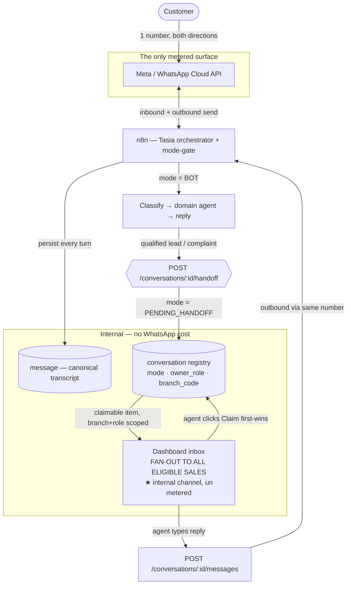

# Single-Number Branch Solution — cost-efficient lead distribution & human takeover

**What this is:** a *branch* (variant) of the reusable **GenAI WhatsApp Chatbot Pattern**,
re-cut for cost. The generic pattern leans on **per-lead WhatsApp groups** and **extra
webhooks** to move a lead from the bot to a human. Both are **metered surfaces on the
WhatsApp Business API** — every group thread and every outbound-to-a-new-party opens its own
billable conversation, and the encrypted WA-Flow webhook adds infra you have to own and pay
for. This branch keeps **one** customer-facing WhatsApp number as the hub, distributes leads
to sales through **internal, unmetered channels** (the dashboard console), and lets a human
**take over in place on the same thread**. Nothing new gets sent over WhatsApp that you
weren't already going to send.

**Reuse target:** built on the existing `TSO-GenAI-Tasia` production stack. It does **not**
introduce a new architecture — it re-wires the *dispatch* step of the
`HANDOFF-TAKEOVER-DESIGN.md` bridge so that "notify sales" stops being a WhatsApp-group send.

**Applies to:** any new line of business that qualifies leads / triages inquiries over
WhatsApp and needs a human to pick up (new-car sales, the ServeNow-style multi-tenant CS
platform, after-sales complaints). Swap the nouns; the money math is the same.

---

## 1. The cost problem this branch removes

The generic pattern (and Tasia's *current* production behaviour) hands a lead to humans by
**writing into a staff WhatsApp group** and, for native forms, by standing up an **encrypted
WA-Flow webhook**. On the WhatsApp Business API both are billable/owned surfaces:

| Costly thing in the generic pattern | Why it costs | What it costs you |
|---|---|---|
| **One WhatsApp group per lead / per branch team** | Every group is its own conversation surface; every dispatch + every age
nt chatter inside it is billable message volume, multiplied by group size | Message/conversation charges scale with **leads ×
 agents**, not with customers served |
| **Bot opens a new WhatsApp thread to each sales agent** | Each new recipient = a new **business-initiated conversation** (i
ts own 24h window / per-message charge) | You pay again just to *notify*, before a single customer-facing reply |
| **A second/parallel number** for internal routing | Another number = another billable line + another opt-in surface | Doubl
es the channel bill |
| **Encrypted WA-Flow data-exchange webhook** (native forms) | Needs an RSA keypair, a backend home, and the flow interaction
s themselves are metered | Infra you own + pay for, plus per-interaction cost |

The insight from `HANDOFF-TAKEOVER-DESIGN.md §1`: *"today a dispatch is a one-way notification
into a staff WhatsApp group."* That group **is** the leak. It doesn't reply to the customer,
it doesn't hold ownership state, and it bills you per team member.

**Design rule for this branch:** WhatsApp is the *customer* channel only. Every
staff-to-staff hop (notify, claim, discuss, escalate) rides a **free internal channel**. The
only WhatsApp traffic is the customer↔business turns you were always going to send.

---

## 2. The core idea, one paragraph

Keep **one** WhatsApp Business number as the single hub for a line of business. The bot
(Tasia's Orchestrator → classify → domain-agent flow) answers on it as today. When a
conversation must go to a human, the bot does **not** create a group or message an agent over
WhatsApp — it flips a **conversation `mode`** to `PENDING_HANDOFF` and the lead appears in a
**dashboard inbox** that all relevant sales/agents watch (the "broadcast to sales"). The first
qualified agent **claims** it (`mode → HUMAN`), and their typed replies go back to the
customer **through the same single number** via n8n's existing outbound send. The customer
sees one continuous thread with one number; internally the lead was fanned out to the whole
sales team over a channel that costs nothing per message.

---

## 3. What "one number broadcast to sales" means — precisely

**It means:** a single lead, the moment it's dispatched, becomes visible to **every eligible
sales agent at once** in the console queue (branch- and role-scoped), and any one of them can
grab it. "Broadcast" = fan-out of a *claimable work item*, not a fan-out of WhatsApp messages.

**It does NOT mean:**
- ❌ Sending the customer's message out to N agents over WhatsApp (that's N billable
  conversations).
- ❌ A WhatsApp broadcast list to staff (still WhatsApp message volume, still opt-in managed).
- ❌ A group per lead (the thing we're removing).

**The fan-out lives in the dashboard**, not on WhatsApp. Cost of showing one lead to 3 or 30
agents in a web inbox = **zero incremental WhatsApp charge**.

---

## 4. Reference architecture

Reading it: **everything inside `Internal — no WhatsApp cost` is free to fan out.** The only
box you pay per-message on is `Meta`, and it carries exactly one thread per customer.

---

## 5. Cost comparison — generic pattern vs this branch

| Event | Generic pattern (groups + webhooks) | This branch (single number + console) |
|---|---|---|
| Notify sales of a new lead | WhatsApp group message → billable, ×team size | Row appears in web inbox → **free** |
| 5 agents "see" the lead | 5 recipients in a billable group | 5 browser tabs, **0 WhatsApp charge** |
| Agent discusses / coordinates | In-group chatter → billable message volume | In-console note / `conversation_event` → **fre
e** |
| Human replies to customer | Same number (fine) | Same number (fine) — **identical cost** |
| Re-approach a cold lead | Group ping + maybe a new thread | One template on the one number (§8) |
| Native form intake | Encrypted WA-Flow webhook (owned infra + metered) | Reuse existing inbound webhook; collect fields in-
chat or in console (§8) |
| **Net customer-facing WhatsApp traffic** | Customer thread **+ every internal hop** | **Only the customer thread** |

The saving is structural: internal coordination cost goes from *O(leads × agents)* on a
metered channel to *O(0)* on the web app you already run.

---

## 6. How it maps onto TSO-GenAI-Tasia (reuse, don't rebuild)

This branch is almost entirely **already designed** in `HANDOFF-TAKEOVER-DESIGN.md`. It reuses:

| Reused piece | From | Role in this branch |
|---|---|---|
| `conversation` table (`mode`, `owner_role`, `owner_agent_id`, `branch_code`) | Handoff doc §3.1 | The single source of "who
 owns this lead" — drives the fan-out queue |
| `conversation_event` (append-only) | §3.2 | Records dispatch/claim/transfer as **free** internal events instead of group me
ssages |
| `message` (canonical transcript) | §13 | One continuous thread across bot→human on the same number |
| n8n **inbound mode-gate** | §4 | `BOT` runs Tasia; `PENDING_HANDOFF`/`HUMAN` persist + go silent — the bot never double-ans
wers a claimed lead |
| n8n **outbound agent-send** | §4 | Agent's typed reply leaves through the **existing single-number** send node |
| Dashboard **agent console** | §6 | This is the "broadcast to sales" surface — the branch+role inbox |
| `master_branch_route` / `master_branch_pic` | §3.3 | Resolve branch+role → which agents see the item (**no group needed any
more**) |

**The one change that defines this branch:** point Tasia's *Dispatch* node at
`POST /conversations/:id/handoff` (sets `PENDING_HANDOFF`) **instead of** the WhatsApp-group
notify. That single re-wire is what converts a metered group-broadcast into a free
console-broadcast. Everything downstream (claim, reply, transfer, handback, SLA) is the
existing bridge.

---

## 7. Lead distribution & claim logic ("the broadcast")

1. **Dispatch (fan-out):** on qualification, Tasia calls `/handoff` with `branch_code` +
   `owner_role` (e.g. `sales`). `mode → PENDING_HANDOFF`. No WhatsApp send.
2. **Scope the audience:** the console inbox query is
   `WHERE mode='PENDING_HANDOFF' AND branch_code=? AND owner_role=?` — every eligible agent for
   that branch/role sees it live (SSE/poll). This is the broadcast, in-app and free.
3. **First-claim-wins (dedupe):** `POST /claim` sets `mode → HUMAN` + `owner_agent_id`
   **atomically** (`UPDATE … WHERE mode='PENDING_HANDOFF'` — the row flips once; late clicks
   get "already claimed"). No two agents can double-work a lead, and no customer gets two
   parallel human threads.
4. **Reply in place:** agent messages go out on the single number; every turn is written to
   `message` so the thread stays whole.
5. **Transfer / escalate:** re-route to another `owner_role` (back to `PENDING_HANDOFF` for
   that queue) or fire the SLA ladder — all as `conversation_event` rows, all internal, all
   free.
6. **Handback:** `mode → BOT`; Tasia resumes on the same number.

**Optional low-cost nudge:** if sales aren't always in the console, a *single* internal ping
(one Telegram/Slack/email/push to the team, or one WA message to **one** shared duty number)
can announce "N leads waiting — open the inbox." That's **one** notification for the whole
team, not one-per-agent, and it carries no customer data — keep it a pointer to the console,
not a copy of the conversation. Prefer a non-WhatsApp channel to keep the WhatsApp bill at
exactly the customer traffic.

---

## 8. Webhooks — keep the one you must, drop the ones you don't

| Webhook | Verdict | Reason |
|---|---|---|
| **Meta inbound message webhook** (customer → business) | **Keep — unavoidable** | This is how any WhatsApp message reaches
n8n at all. It's the *one* required webhook; it's not the cost problem. |
| **Meta delivery/status webhook** | Keep (cheap, optional) | Powers delivery ticks on the transcript; low volume. |
| **Encrypted WA-Flow data-exchange webhook** (native forms) | **Drop for this branch** | Needs RSA keypair + owned backend +
 metered flow interactions. Collect the same fields **conversationally in-chat** (Tasia already does slot-filling) or **in th
e console** after claim. Only bring it back if a specific LOB genuinely needs a native form UX. |

So "webhooks are charged" is handled by **not adding the optional metered one** — you keep the
single mandatory inbound webhook you already run.

**24-hour window still applies** (Handoff doc §7): free-text replies only within 24h of the
customer's last message; a cold re-approach needs an **approved template** on the one number.
Catalogue those templates early — that's the *only* extra outbound you should ever pay for.

---

## 9. Build vs reuse

Almost nothing new to build — this branch is a **configuration + one re-wire** of the existing
bridge:

| Need | Do this |
|---|---|
| Conversation ownership + fan-out queue | **Reuse** `conversation` + console inbox (Handoff §3, §6) |
| Notify sales without WhatsApp cost | **Re-wire** Dispatch → `/handoff` (Handoff §9 step 5) — the defining change |
| Dedupe concurrent claims | **Reuse** atomic `/claim` (Handoff §5) |
| Human reply on the one number | **Reuse** outbound agent-send (Handoff §4) |
| Whole-thread transcript across takeover | **Reuse** `message` (Handoff §13) |
| Branch/role targeting of the broadcast | **Reuse** `master_branch_route` / `master_branch_pic` |
| (Optional) one team-wide nudge | **Add** a single non-WhatsApp notification to the team, pointing at the console |
| Native forms | **Skip** the WA-Flow webhook; use in-chat slot-filling |

---

## 10. Suggested build order

1. Ship the `HANDOFF-TAKEOVER-DESIGN.md` bridge first (tables → backend → n8n gate → console).
   This branch *is* that bridge with the group-dispatch removed.
2. **Re-point Dispatch** from group-notify → `/handoff`. Verify the lead now appears in the
   console and **nothing** was sent to a WhatsApp group.
3. Confirm the inbox query is scoped to `branch_code` + `owner_role` so the fan-out reaches the
   right — and only the right — agents.
4. Verify **first-claim-wins** under two agents clicking at once (atomic update).
5. Confirm the agent reply exits on the **same single number** and lands in the customer's
   existing thread.
6. (Optional) add one team-wide, non-WhatsApp "leads waiting" nudge.
7. Catalogue re-approach **templates** for cold leads past 24h (the only sanctioned extra
   outbound).

---

## 11. What NOT to do

- ❌ **Don't create a WhatsApp group** (per-lead or per-team) to notify sales — that's the exact
  cost this branch removes.
- ❌ **Don't message each agent over WhatsApp** to hand off — each recipient is a new billable
  conversation. Fan out in the console.
- ❌ **Don't stand up a second WhatsApp number** for internal routing — one hub number only.
- ❌ **Don't add the encrypted WA-Flow webhook** unless a specific LOB truly needs native forms;
  slot-fill in chat instead.
- ❌ **Don't let the bot keep replying after claim** — the mode-gate must go silent on
  `PENDING_HANDOFF` / `HUMAN`, or the customer gets the bot and a human at once (and you pay for
  the bot's extra turns).
- ❌ **Don't copy the conversation into the team nudge** — the nudge is a pointer to the console,
  not a WhatsApp re-send of customer data.

---

## 12. Applying it to a new line of business (e.g. the ServeNow-style CS platform)

The money math generalises. For any new LOB:

- **One number per tenant/LOB is the hub**; fan-out to that tenant's agents happens in the
  shared inbox, scoped by tenant + queue (the multi-tenant analogue of `branch_code` +
  `owner_role`).
- **Internal coordination never touches WhatsApp** — omnichannel routing, agent assist,
  ticket classification, and SLA all run on your own web/app plane, which is what a platform
  like ServeNow bills *its* customers for anyway.
- **The metered surface stays flat** at "customer conversations served," so gross margin
  improves as you add agents/queues — directly relevant to the ServeNow target of lifting net
  margin from 2.5% → 15–20% while cutting churn: faster human pickup (SLA ladder) without a
  WhatsApp bill that grows with headcount.

> Bottom line: the generic pattern pays WhatsApp to move work *between staff*. This branch
> only ever pays WhatsApp to talk to the *customer*, and moves work between staff for free.