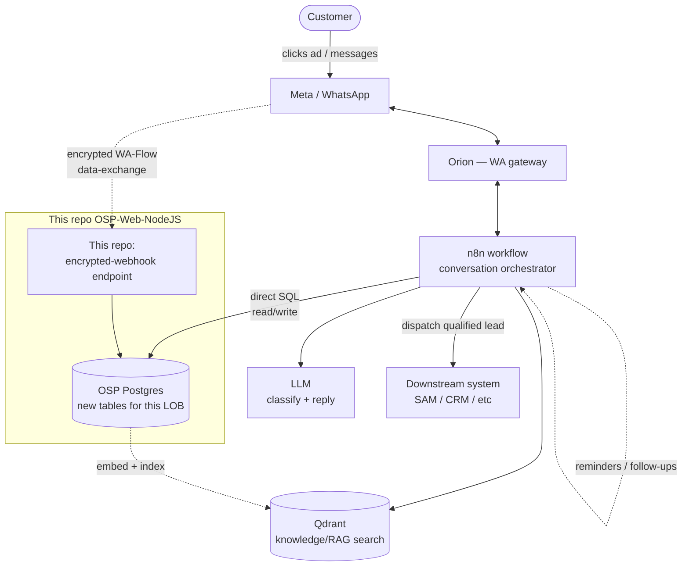

# GenAI WhatsApp Chatbot Pattern — reusable across lines of business

**Audience:** a teammate or another Claude/agent picking up a *new* line-of-business chatbot
(different product, different table names) who wants to reuse the approach we already
built for the **Virtual Branch** project, without re-deriving it from scratch.

**Worked example this pattern was extracted from:** Virtual Branch (ads-driven WhatsApp lead
qualification chatbot for new-car sales). See `Main Tasia` (the after-sales chatbot, same
pattern, already in production) and `VB - main` / `VB - pricing` / `VB - dispatch` (the n8n
workflows built for Virtual Branch, not stored in this repo — they live in n8n).

This doc is deliberately **generic**: swap "leads", "MasterAd", "SAM" for whatever nouns your
line of business uses. The shape stays the same.

---

## 1. The core idea, one paragraph

The conversational logic (prompting, tool-calling, message routing, template sends) lives in
**n8n**, not in this repo. This repo (**OSP-Web-NodeJS**) is the **data + integration layer**:
it owns the Postgres tables the conversation reads/writes, exposes the handful of things n8n
and Meta genuinely cannot do themselves (webhook receivers for encrypted Meta callbacks,
downstream-system dispatch, reference-data CRUD), and — where the access pattern is simple and
already precedented — lets n8n hit its Postgres tables **directly via SQL**, skipping a REST
layer entirely. New business code in this repo should default to being small: most of a new
line of business's "brain" is n8n workflow, not NestJS modules.

## 2. Division of responsibilities

| Layer | Owns | Does NOT own |
|---|---|---|
| **n8n** (workflow team) | Conversation state machine, LLM prompting/tool-calling, WA template sends via Orion, classify→rou
te logic, RAG search calls to Qdrant | DB migrations, encrypted Meta callback handling, downstream system auth (SAM/LMS/etc c
redentials) |
| **This repo (OSP)** | Postgres schema + migrations for new tables, thin reference-data/read endpoints, encrypted-webhook re
ceivers Meta calls directly, dispatch/notification calls to downstream systems, (optionally) a QA/monitoring dashboard's read
 API | Conversation logic, prompt engineering, WA template design |
| **External systems** (Orion, Meta, downstream CRM/SaaS) | WA transport, ad click-through payloads, receiving qualified lead
s | Nothing in this repo talks to them except via the integration points above |

Confirm this split explicitly with whoever owns the new line of business before building —
it was the single biggest source of rework on Virtual Branch (see §7).

## 3. Reference architecture

Key decisions baked into this diagram, all confirmed on Virtual Branch and worth re-confirming
per LOB rather than assuming:

- **n8n reads/writes OSP tables directly via SQL**, the same way the existing `Dispatcher`
  workflow queries `master_branch_route`. This is *not* a universal n8n pattern — it's specific
  to this codebase's precedent. Confirm it's still the preferred approach before repeating it;
  a REST layer is the fallback if the new LOB's access pattern is more complex (multi-step
  transactions, business validation beyond a `CHECK` constraint, etc).
- **Qdrant is fed by an embed/ingest pipeline sourced from an OSP table**, not queried live
  against OSP. Content → OSP table (source of truth, editable) → embedding job → Qdrant index →
  n8n RAG tool. Confirm who owns the embedding job before assuming it's "someone else's job" —
  on Virtual Branch this was left open.
- **This repo does NOT own conversation session/message logging** unless a specific reuse
  decision says so. `Main Tasia` uses a separate microservice
  (`genai-tasia-vector-store-service`, namespace `aura`) for that; Virtual Branch modeled
  "session" as just a status field on its lead record instead of a separate table (see §6).
  Don't build a new logging service without checking whether an existing one should be reused.

## 4. Reusable building blocks already in this repo

Don't reinvent these — copy the shape, swap the payload:

| Need | Copy this pattern | Why |
|---|---|---|
| Auth guard on service-to-service endpoints (n8n → OSP) | `ServiceValidationMiddleware` — `shared/user-management/src/lib/mi
ddleware/service.middleware.ts` | Same guard already used by `group-init`/`webhooks` modules |
| Auth guard on human/dashboard endpoints | `WebValidationMiddleware` (same package) | Web session auth, distinct from servic
e auth |
| Dispatching a qualified lead/event to an external SaaS | `SAMDiscountNotificationService` — `shared/sam-api/src/lib/service
s/notification.service.ts` | OAuth2 client-credentials token fetch + `POST {base_url}/api/notification/<type>`; add a sibling
 method rather than a new integration package |
| Scheduled follow-ups / reminders | `apps/mra-blast-wa-worker/src/app/cron/cron.service.ts` | `@nestjs/schedule`-based stage
d jobs — model any H+N reminder logic on this rather than a long-lived n8n `Wait` node (fragile across n8n restarts, doesn't
scale per-lead) |
| Triggering n8n from a NestJS cron/event | `sendToN8N()` — `shared/cdp/src/lib/modules/integrator/integrator.service.ts` | F
orward-to-n8n pattern already exists; don't build a new HTTP client for this |
| Phone number normalization | `stripPhonePrefix`/`formatPhoneNumber`/`isValidPhoneNumber` in `GroupsService` | Already handl
es WA `wa_id` quirks |
| Vehicle/product catalog reads (if the LOB is automotive) | `CanomicalModelHybris`/`BaseProduct`/`VariantProduct` entities —
 `shared/databases/src/psql5/osp/entities/` | Already populated by `aura-tasia-kafka-consumer` from Digiroom; expose thin rea
ds, don't re-ingest |
| New Postgres tables + migrations | Same folder/convention as `shared/databases/src/psql5/osp/migrations/1786523398000-init-
table-virtual-branch.ts` and its paired entity `shared/databases/src/psql5/osp/entities/ChatbotSummaryVirtualBranch.entity.ts
` | Established TypeORM migration convention for this schema |

## 5. Standard "new endpoint" shape

When a new LOB genuinely needs a REST endpoint (not direct SQL from n8n), keep it **flexible
and coarse-grained**, not one bespoke endpoint per field:

- `POST /<lob>/<entity>` — get-or-create, called once per new conversation
- `PATCH /<lob>/<entity>/:id` — one endpoint accepting any subset of updatable fields, matching
  how a conversation naturally drips in data ("update model", then later "update city") rather
  than a separate endpoint per field
- `GET /<lob>/<entity>/:id` — final-state read, used both by n8n before dispatch and by any
  dashboard
- `GET /<lob>/<entity>?filter=` — list view for a dashboard, if one exists
- `POST /<lob>/<entity>/:id/dispatch` — validates required fields are present, resolves any
  reference-data lookups (region→branch, etc), calls the downstream notification method, marks
  status

Guard all of these with `ServiceValidationMiddleware` except the dashboard's reads
(`WebValidationMiddleware`) and any endpoint a third party like Meta calls directly and
encrypts itself (see next section — that one has no bearer-token guard at all, the encryption
*is* the auth boundary).

## 6. Session/state modeling — pick one deliberately

Two options seen across these projects; pick per-LOB rather than defaulting:

1. **Separate session table + Redis TTL cache** (Main Tasia's pattern) — needed when a
   conversation can go idle and resume, and you need fast reads on "is this session still
   active" outside the primary record.
2. **The business record itself doubles as the session** (Virtual Branch's pattern) — a
   `status` enum on the lead/case table (e.g. `Open`, `FollowUp`, `Solved`, `Drop`) *is* the
   session state; "any row not in a terminal status = active session." Simpler, one fewer
   table, works when there's already a 1:1 business record per conversation and no need for
   sub-session-granularity caching.

If the LOB needs live human-agent takeover mid-conversation, check whether
`genai-tasia-vector-store-service` (or whatever succeeds it) should be reused for message
logging/takeover detection before building a new one — this was still an open question on
Virtual Branch (pending confirmation with the DB owner) and is worth resolving early, since it
affects whether option 1 or 2 above is viable.

## 7. Things to nail down explicitly, early, per new LOB

These were the exact questions that caused rework on Virtual Branch — ask them up front for
any new line of business before writing code:

- **Who builds what, precisely.** "n8n side" vs "backend/migrations side" vs "webhook you hand
  to us" — get this in writing per integration point, not just "backend handles the API."
- **Direct SQL vs REST**, per table — don't assume; it was a real open question until
  explicitly resolved.
- **Which LLM/model config** — reuse an existing one (e.g. "same as Main Tasia") unless there's
  a reason not to; don't spin up a new provider integration per LOB.
- **Does this LOB reuse an existing sibling workflow/app, or is it a clean new one?** On
  Virtual Branch, extending an existing app (`aura-tasia`) was floated and then explicitly
  ruled out by the business owner ("no more aura-tasia") in favor of a dedicated new workflow —
  confirm this rather than assuming either direction.
- **Who owns the encrypted Meta WA-Flow data-exchange endpoint** (if the LOB uses native
  WhatsApp forms). This needs an RSA keypair provisioned and a real backend home — don't leave
  it homeless in the architecture the way it was left open here.
- **What's the actual downstream dispatch contract** (endpoint, payload, auth) — get the real
  API before wiring a "TBC" placeholder into a workflow that's about to be handed off.
- **Reference/lookup data ownership** (region/branch mapping, pricing, etc) — confirm who
  maintains it and whether it's a one-time seed or needs ongoing CRUD.

## 8. Suggested build order for a new LOB

1. Confirm §7's answers first — they change the shape of everything below.
2. Core entity + migration for the LOB's primary record (mirrors
   `ChatbotSummaryVirtualBranch`) — unblocks n8n's first read/write.
3. Any reference-data table + lookup endpoint the conversation needs mid-flow (region/branch,
   pricing, etc).
4. Dispatch endpoint + downstream notification method (pending the real contract from §7).
5. Encrypted-webhook endpoint, if the LOB uses native WA Flows (pending RSA provisioning).
6. Reminder/follow-up cron, if the LOB needs staged nudges.
7. Dashboard read endpoints, if a monitoring UI is in scope.
8. n8n workflow(s) — classify → route → domain agent(s) with tools, mirroring the
   Orchestrator/LogicAgent pattern already in production. This is usually the largest single
   piece of work and lives outside this repo.

## 9. What NOT to do

- Don't build a new REST CRUD layer for tables n8n can query directly with SQL, unless the
  access pattern genuinely needs it (multi-step transactions, complex validation).
- Don't stand up a new session-cache/message-logging service without checking whether an
  existing one should be extended or reused.
- Don't invent a new downstream-notification client when `shared/sam-api`'s pattern (or
  whatever the target system's equivalent already is) can be extended with one more method.
- Don't let a long-lived n8n `Wait` node carry multi-day reminder timing — use a NestJS cron +
  `sendToN8N()` to wake the workflow instead.